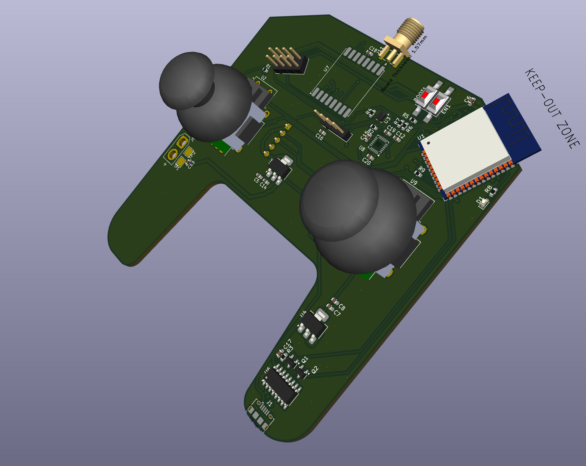
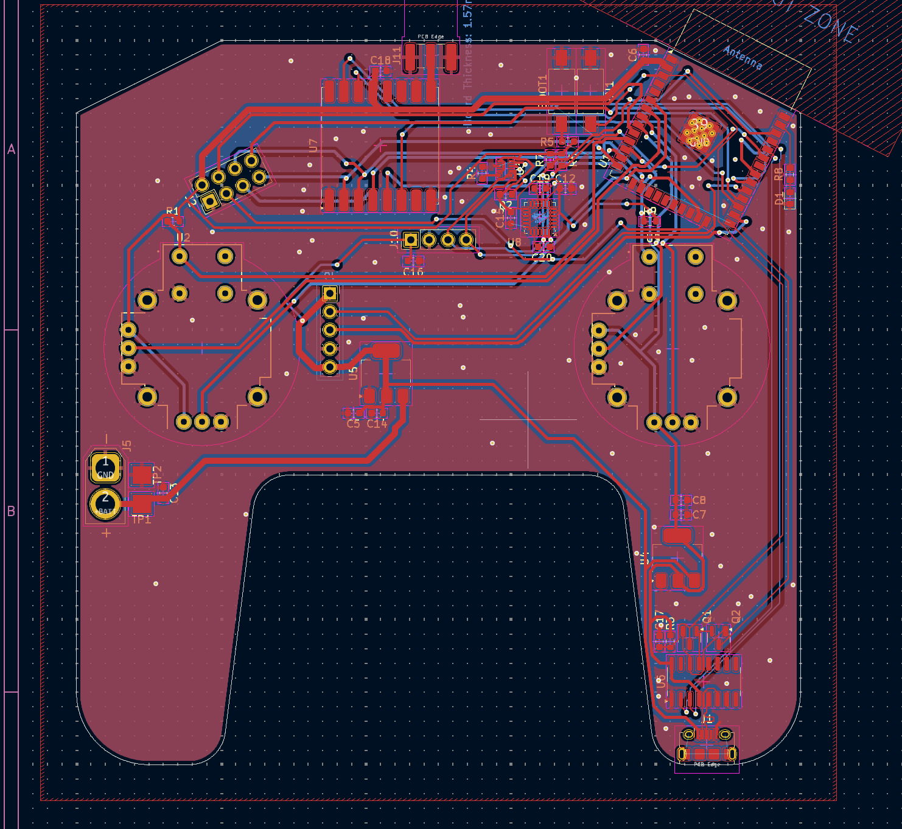
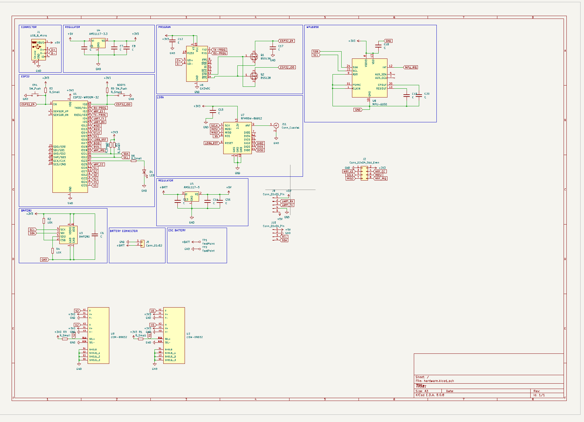

# **Triple-Radio Remote Controller PCB**

A compact, hand-held remote that combines **Wi-Fi / Bluetooth (ESP32)**, **2.4 GHz nRF24L01+** and **868/915 MHz LoRa (RFM95W)** in a single, joystick-style board.  
It is intended as a flexible radio interface for robotics, drones, RC models, telemetry links or IoT experimentation where different wireless technologies are useful at once.

|  |  |
| ----------------------------- | ------------------------------ |

---

## Table of Contents
1. [Features](#features)  
2. [Hardware Overview](#hardware-overview)  
3. [Schematic Blocks](#schematic-blocks)  
4. [Power Architecture](#power-architecture)  
5. [Pin Map](#pin-map)  
6. [Firmware](#firmware)  
7. [Getting Started](#getting-started)  
8. [Directory Layout](#directory-layout)  
9. [Road-Map](#road-map)  
10. [License](#license)

---

## Features
* **MCU — ESP32-WROOM-32**  
  * Dual-core Xtensa @ 240 MHz, 520 KB SRAM  
  * Integrated Wi-Fi 802.11 b/g/n + Bluetooth Classic/LE  
* **Radios**  
  * **nRF24L01+** – 2.4 GHz packet radio via 8-pin vertical socket  
  * **RFM95W** – Semtech SX1276 LoRa transceiver, SMA edge connector (keep-out ensured)  
* **Controls**  
  * Dual analog thumb joysticks (SparkFun COM-09032) with push-buttons  
  * One user LED (GPIO-controlled)  
* **Sensors**  
  * **MPU-6050** 6-axis IMU (gyro + accel)  
  * **BMP-280** barometric pressure / temperature sensor  
* **USB & Programming**  
  * On-board CH340C USB-to-UART with auto-reset/boot circuitry  
  * Standard USB-C connector (5 V input & data)  
* **Power**  
  * 2-pin JST-PH for Li-Ion/Li-Po battery (“+BATT”)  
  * AMS1117-3 V3 LDO for logic / radios  
  * AMS1117-5 V rail for external accessories (ESC, servos, etc.)  
  * Reverse-polarity and inrush-limit protections  
* **Expansion / Debug**  
  * 5-pin 5 V UART header  
  * 4-pin 5 V I²C header  
  * Plenty of un-populated GPIO test-pads on bottom layer  
* Finished board: **74 mm × 74 mm**, 2-layer, ENIG, green solder-mask.

---

## Hardware Overview


| Block | Purpose | Interfaces |
|-------|---------|------------|
| ESP32-WROOM-32 | Central MCU; Wi-Fi/BLE | SPI, I²C, UART, ADC |
| RFM95W-868/915 | Long-range LoRa | SPI (SCK/MISO/MOSI/SS) + DIO0/1/2 + RESET |
| nRF24L01+ socket | Low-latency 2.4 GHz | Same SPI bus, CE/CSN/IRQ lines |
| MPU-6050 | Motion sensing | I²C @ 400 kHz |
| BMP-280 | Altitude / temp | I²C (wired for I²C) |
| Dual joysticks | User input | 4 × ADC + 2 × GPIO (switches) |
| CH340C | USB-UART | UART 0 (TX0/RX0), DTR/RTS auto reset |
| AMS1117-3 V3 | Logic 3.3 V rail | Up to 1 A |
| AMS1117-5 V | Aux 5 V rail | Up to 1 A |

---

## Power Architecture
```
Li-Po (3 V0 – 4 V2)
        │
        ├─ AMS1117-5 V ───► 5 V header / accessories
        │
        └─ AMS1117-3 V3 ──► ESP32, sensors, radios (on-board)
```
The USB-C port supplies 5 V when plugged; if a battery is present it is **not charged** – add an external charger if required.

---

## Pin Map

| Signal | ESP32 GPIO | Notes |
|--------|-----------|-------|
| **LoRa (RFM95W)** |||
| LORA_SS (NSS) | 5 | Shared SPI SS |
| LORA_RST | 26 | Active-low reset |
| LORA_DIO0 | 34 | IRQ – input-only |
| LORA_DIO1 | 35 | Optional |
| **nRF24L01+** |||
| NRF_SS (CSN) | 33 |
| NRF_CE | 32 |
| NRF_IRQ | 27 |
| **Shared SPI bus** |||
| SCK | 18 |
| MOSI | 23 |
| MISO | 19 |
| **I²C bus** |||
| SDA | 21 | MPU-6050, BMP-280, external header |
| SCL | 22 |
| **Joysticks** |||
| Stick-L H | 36 (ADC1_0) |
| Stick-L V | 39 (ADC1_3) |
| Stick-R H | 34 (ADC1_6) |
| Stick-R V | 35 (ADC1_7) |
| Stick-L Btn | 13 |
| Stick-R Btn | 12 |
| **USB-UART** |||
| TX0 | 1 |
| RX0 | 3 |
| DTR / RTS | Auto-reset circuit |

All unused pins are broken out to pads for hacking.

---

## Firmware

Any ESP32 framework will work; the board is tested with **PlatformIO + Arduino**.  
Example `platformio.ini` snippet:

```ini
[env:esp32-remote]
platform      = espressif32
board         = esp32dev
framework     = arduino
monitor_speed = 115200
build_flags   =
  -D LORA_SS=5
  -D LORA_RST=26
  -D LORA_DIO0=34
  -D NRF_CE=32
  -D NRF_CS=33
  -D NRF_IRQ=27
lib_deps =
  sandeepmistry/LoRa
  maniacbug/RF24
  adafruit/Adafruit MPU6050
  adafruit/Adafruit BMP280 Library
```

---

## Getting Started

1. **Clone** the repository  

   ```bash
   git clone https://github.com/<user>/<repo>.git
   cd triple-radio-remote
   ```

2. **Install PlatformIO** (VS Code extension or CLI).  
3. **Select the env** in `platformio.ini`, edit radio pins if you changed the board.  
4. **Connect USB-C**, hold **BOOT** (if populated) on first flash, press *Upload*.  
5. Verify serial output at **115 200 baud**.

### LoRa / nRF24L01+ demos
Example sketches are in `firmware/examples/`:

* `lora_ping/` – bidirectional ping using SX1276  
* `rf24_controller/` – joystick values sent every 20 ms to a base-station  
* `wifi_update/` – OTA update via Wi-Fi AP  

Build & flash with:

```bash
pio run -e esp32-remote -t upload -d firmware/examples/lora_ping
```

---

## Directory Layout
```
.
├─ firmware/              → PlatformIO source
├─ hardware/
│  ├─ kicad/              → .kicad_pcb, .sch, libraries
│  ├─ gerber/             → ready for fabrication
│  └─ stl/                → optional enclosure models
├─ docs/
│  ├─ img/                → renders & photos used in README
│  └─ datasheets/
└─ LICENSE
```

---

## Road-Map
* Li-Po charging / fuel-gauge on-board  
* Hall-effect joysticks option  
* Enclosure with TPU grips  
* Support for 900 MHz nRF905 as fourth radio  

---

## License
Hardware is released under **CERN-OHL-S v2**.  
Firmware samples are **MIT**.  
See individual source files for details.

---

*If you make something cool with this board, please open a pull-request and show it off!*